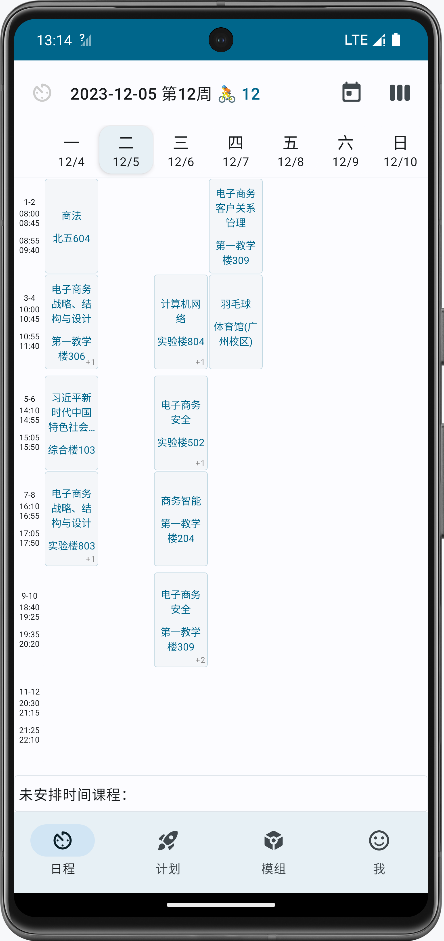
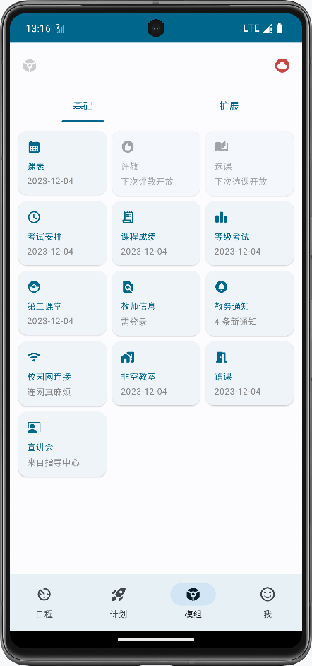

# Afterglow

```
更加快捷高效的下一代广财教务查询工具
```

<div style="display: flex; justify-content: center;">
    
</div>

这是一款广财教务系统信息同步、查询工具。使用 `Jetpack Compose`构建 UI，
由 `DataStore` 和 `Gson` 协同完成本地化存储，使用 `Kotlin` 协程、`Flow`。


## ✂️截图
<div style="display: flex;">
    
    
    
    
</div>


## ✨Afterglow 的优势

* ### 更快的同步速度🚀
1. 数据处理操作都在本地，处理速度取决于手机配置。
2. 打开自动登录功能。

* ### 更加安全🔒
1. 项目开源。
2. 无服务器代理数据处理的任何环节，杜绝信息窃取。

* ### 更加方便的操作🧙‍♂️
1. 无需手动输入验证码即可登录。
2. 更加顺畅的操作。

- ### 更多的功能🎨
1. 教务系统相关功能。课表、考试安排、课程成绩、等级考试成绩、教师信息、非空教室、蹭课。
2. 第二课堂、教务通知、宣讲会、校园网连接。
3. 随机数、网络请求、计划。


## 🐞Afterglow 的缺陷

- ### 代码需要优化
- ### 仅支持 Android
- ### 部分功能仍存在较大优化空间


## 📞联系作者

### 手机号（微信同）
```17875765201```


## ❤️捐赠
Afterglow是免费的，任何时候都是，如果愿意的话，可以请我喝杯奶茶（应该有一两块的奶茶叭😊）。

<div style="display: flex; justify-content: center;">
    
</div>